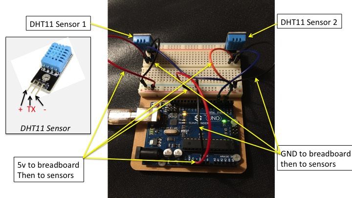

# Reading Temperature and Humidity Data from 2 DHT11 sensors

This is an example of how to read data from two separate DHT11 temperature and humidity sensors using an Arduino UNO.
The underlying library I am using is SimpleDHT from :
https://github.com/winlinvip/SimpleDHT


## Pre-requisites SimpleDHT 
 
Instructions on how to import the SimpleDHT library in your Arduino UNO can be found at:
https://github.com/winlinvip/SimpleDHT

## Arduino and Sensor Wiring
The following is a picture of the wiring I used in my example.



In my example, Sensor 1 output data pin was connected to Arduino UNO digital input pin 2 and Sensor 2 output data pin was connected to digital input pin 4.

## My Example and Output
Once you have installed the SimpleDHT library, use my code (examples/santosomar.ino)

> Important: Don't configure it to do more than 1 Hz sampling rate (once every second), if not you will get errors. In my example I am using 1500 (1.5 seconds).

Open the Serial Window of Arduino IDE. The output should look like this: 

```
=================================
Getting data from sensor 1...
Sample OK: 22 *C, 71 *F, 32 % humidity
Getting data from sensor 2...
Sample OK: 22 *C, 71 *F, 32 % humidity
=================================
Getting data from sensor 1...
Sample OK: 22 *C, 71 *F, 33 % humidity
Getting data from sensor 2...
Sample OK: 22 *C, 71 *F, 32 % humidity
=================================
Getting data from sensor 1...
Sample OK: 22 *C, 71 *F, 32 % humidity
Getting data from sensor 2...
Sample OK: 22 *C, 71 *F, 32 % humidity
```

## Other References and Links
[adafruit/DHT-sensor-library](https://github.com/adafruit/DHT-sensor-library)
